# Milo the Little Moon — A Story Coloring Book

## Page 1: Milo, the Little Moon

Milo is a little moon.
He glows softly in the night sky.

**Coloring idea:** Color Milo bright yellow and the sky dark blue.

\newpage

## Page 2: Milo Waves to Earth

Milo looks down at Earth.
"Hello, friends!" he says.

**Coloring idea:** Add colorful pajamas to the children below.

\newpage

## Page 3: The First Cloud

A fluffy cloud drifts by.
Milo gently tickles the cloud.

**Coloring idea:** Make the cloud white, pink, or rainbow.

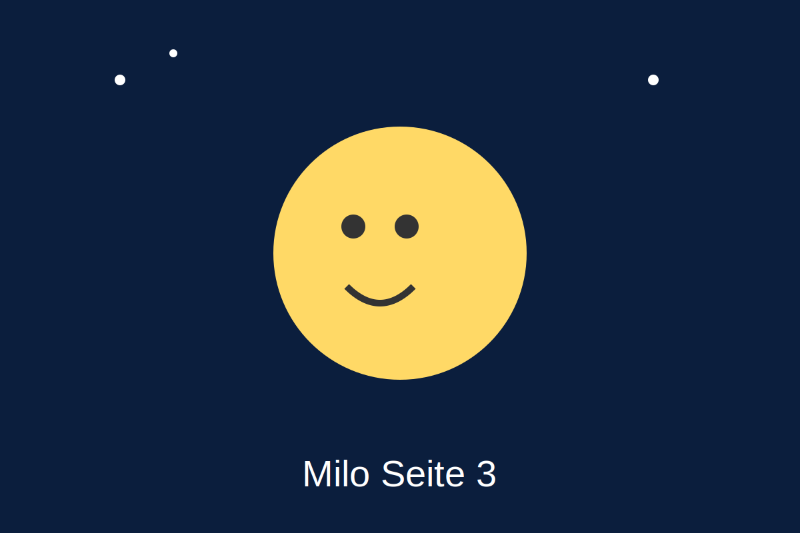

\newpage

## Page 4: Dancing Stars

Many stars sparkle bright.
They dance in a circle with Milo.

**Coloring idea:** Give each star a different color.

\newpage

## Page 5: Milo Feels Sleepy

Milo gives a tiny yawn.
"I am a little sleepy," he whispers.

**Coloring idea:** Draw a soft blanket of night around Milo.

\newpage

## Page 6: A Goodnight Song

The wind sings a quiet song.
Milo listens very calmly.

**Coloring idea:** Color the wind as swirls of light blue.

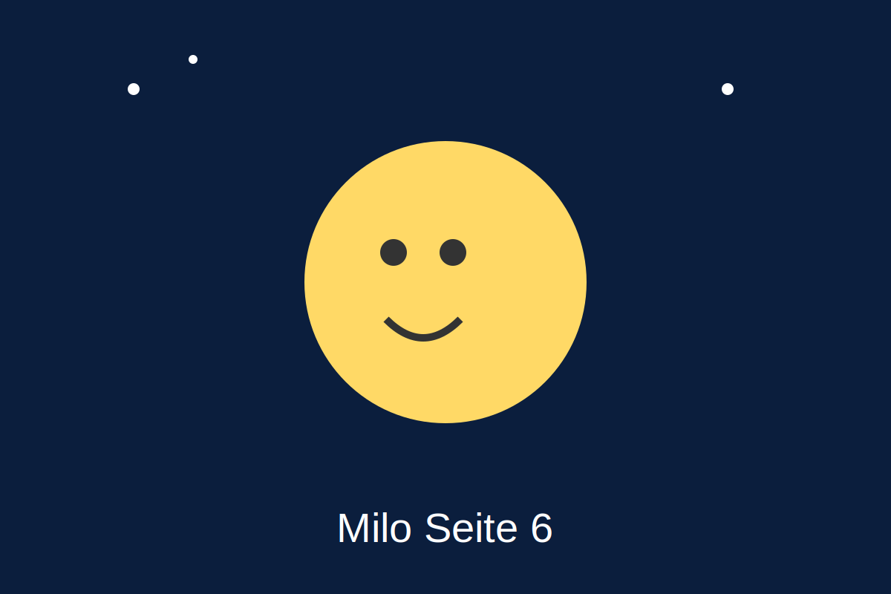

\newpage

## Page 7: The Little Comet

A little comet zooms by.
"Good night, Milo!" it calls.

**Coloring idea:** Give the comet a glowing tail.

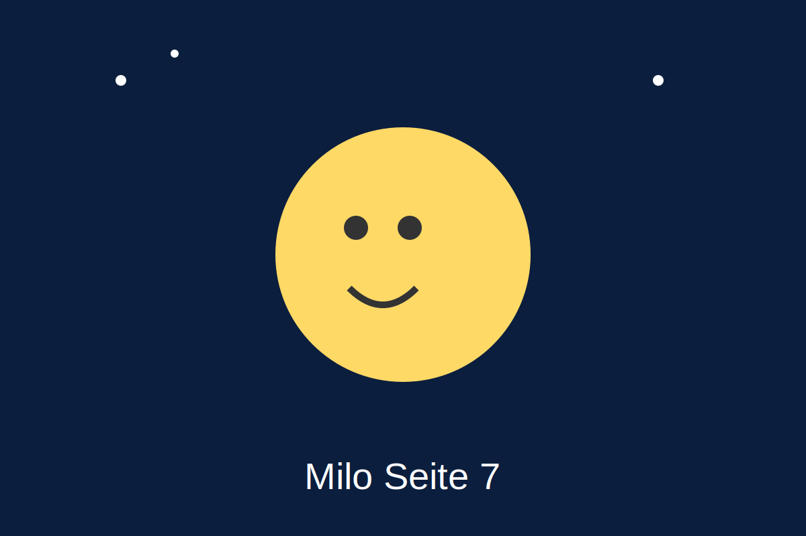

\newpage

## Page 8: Milo Smiles

Milo smiles very wide.
His light feels warm and kind.

**Coloring idea:** Add hearts or tiny stars around Milo.

\newpage

## Page 9: A Peaceful Night

Everything is quiet and peaceful.
Milo watches over everyone.

**Coloring idea:** Draw sleeping animals below the sky.

\newpage

## Page 10: Milo Above the Houses

Milo shines above every house.
Children cuddle in their beds.

**Coloring idea:** Color each house in a different style.

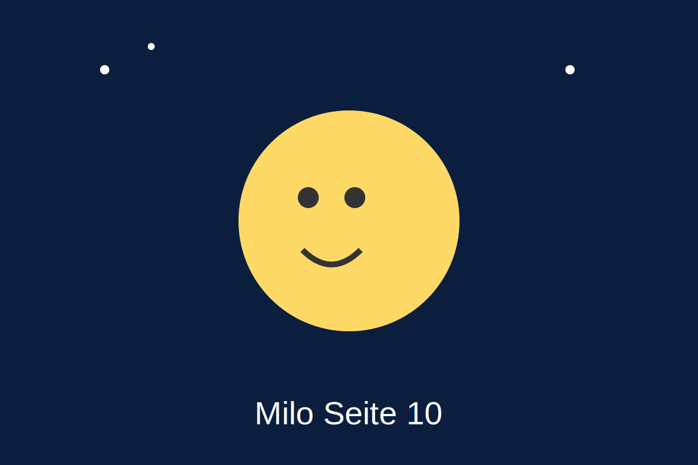

\newpage

## Page 11: Almost Morning

The sky slowly grows brighter.
"Sleep well," Milo whispers.

**Coloring idea:** Blend dark blue into light purple.

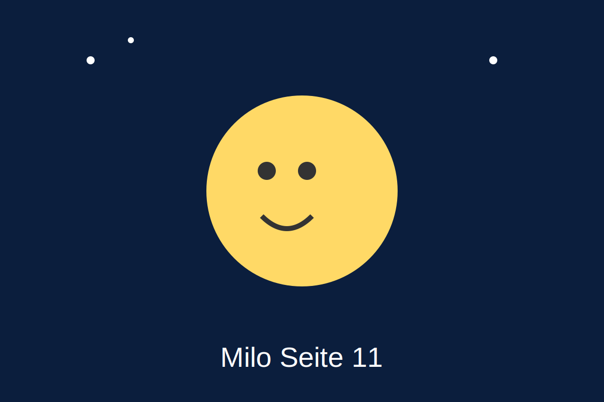

\newpage

## Page 12: See You Tomorrow, Milo

The sun begins to wake up.
"See you tomorrow, friends!" says Milo.

**Coloring idea:** Color a soft sunrise behind Milo.

\newpage

# Coloring Pages

## Coloring Page 1

Color Milo and his friends any way you like!

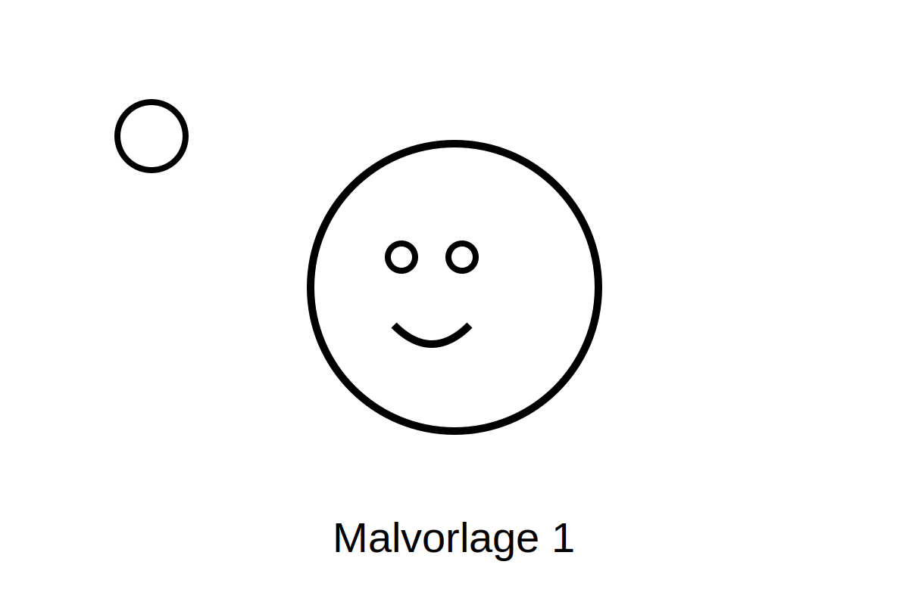

\newpage

## Coloring Page 2

Color Milo and his friends any way you like!

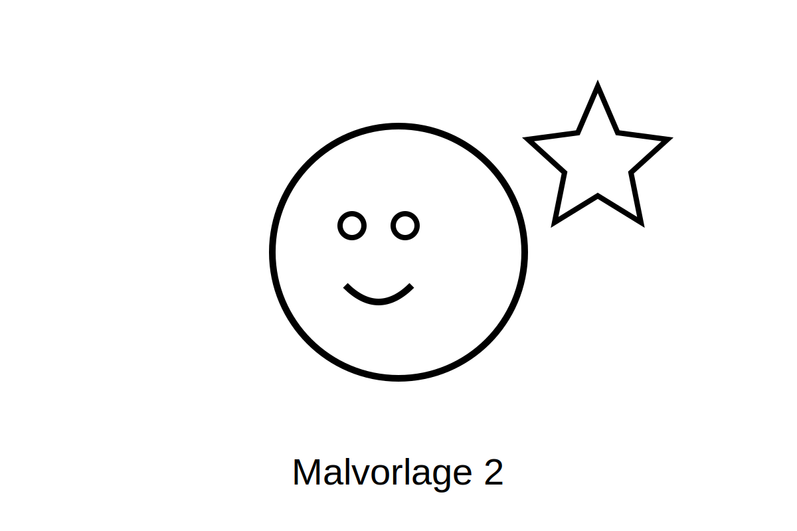

\newpage

## Coloring Page 3

Color Milo and his friends any way you like!

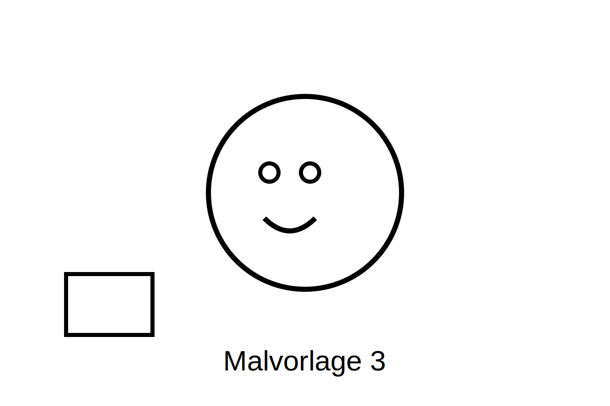

\newpage

## Coloring Page 4

Color Milo and his friends any way you like!

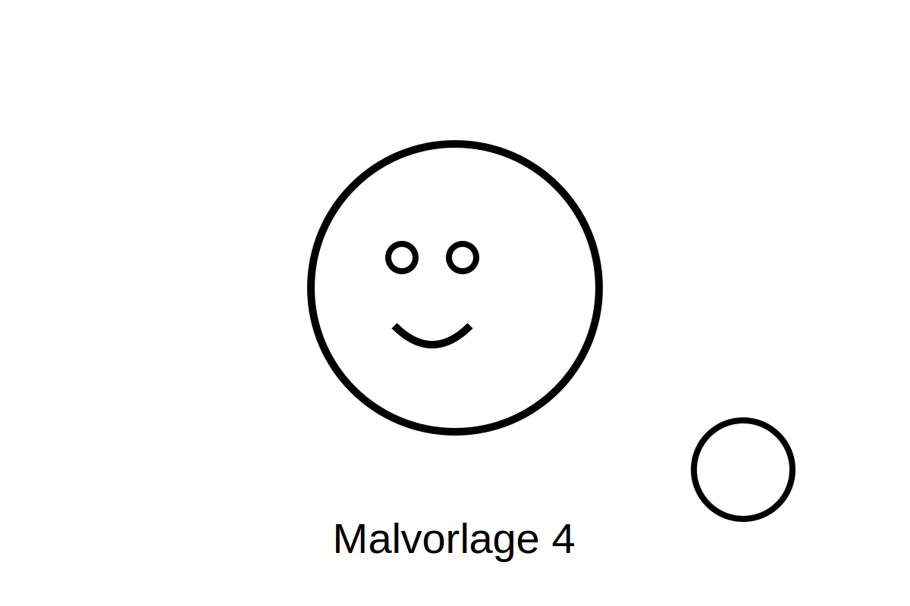

\newpage

## Coloring Page 5

Color Milo and his friends any way you like!

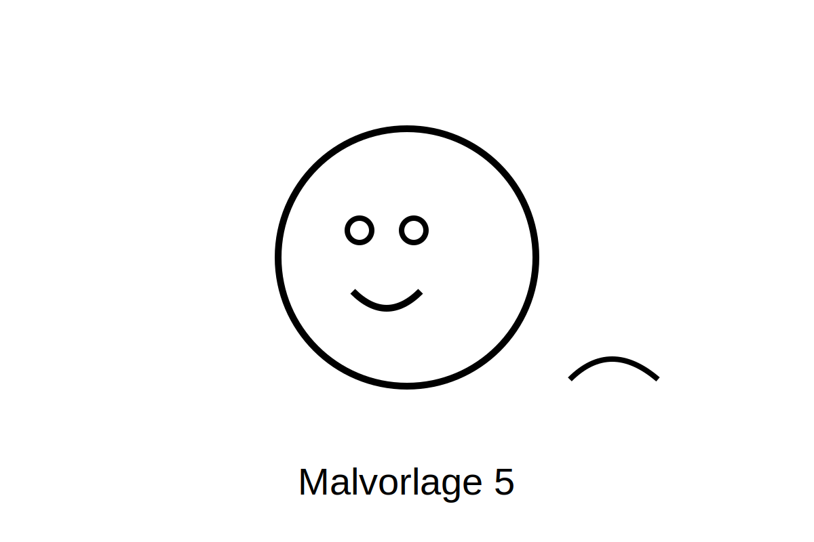

\newpage

## Coloring Page 6

Color Milo and his friends any way you like!

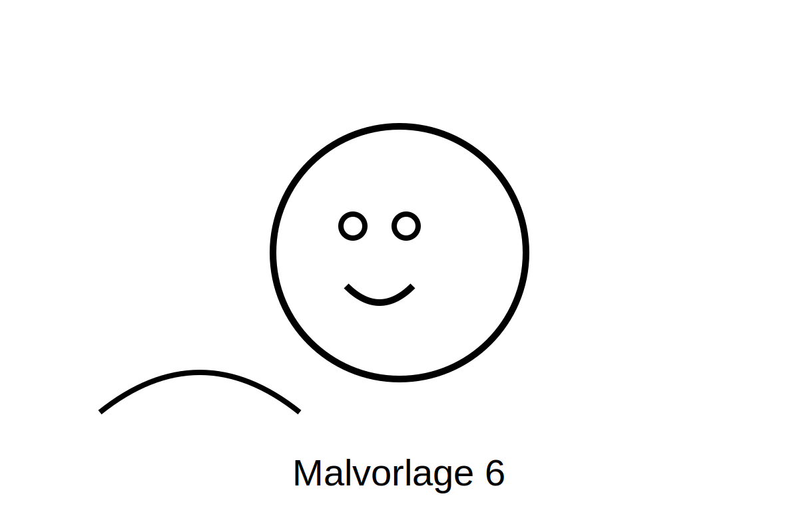
